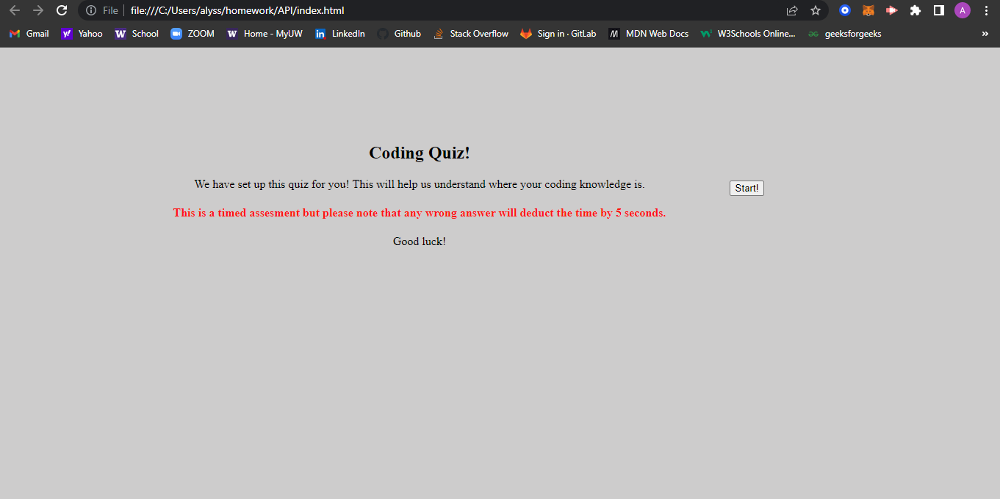

<h1> JavaScript Quiz! </h1>

In this assignment we were asked to build a Web Delceopment Quiz for JS!

<h1> Acceptance Criteria! </h1>

<li>WHEN I click the start button
THEN a timer starts and I am presented with a question</li>
<li>WHEN I answer a question
THEN I am presented with another question</li>
<li>WHEN I answer a question incorrectly
THEN time is subtracted from the clock</li>
<li>WHEN all questions are answered or the timer reaches 0
THEN the game is over </li>
<li>WHEN the game is over
THEN I can save my initials and score</li>

<h2>Screenshot: </h2>

[github]https://github.com/alyesp/JS-quest
[githubpages]https://alyesp.github.io/JS-quest/